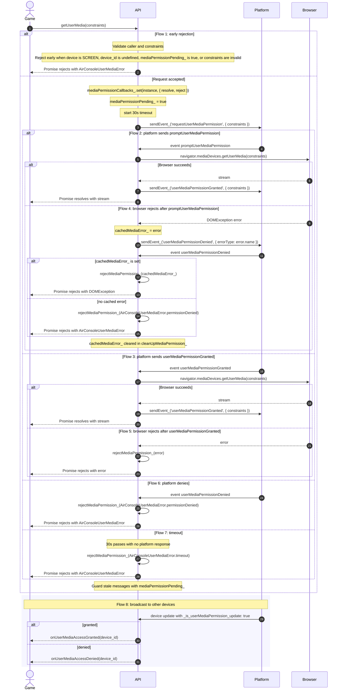
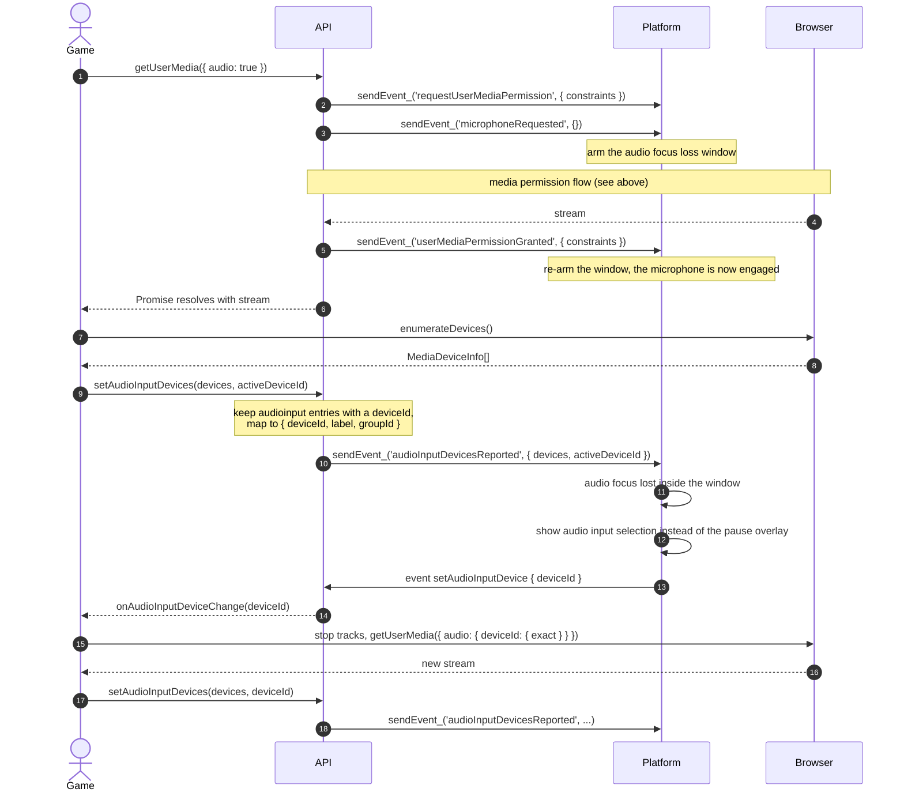

# Media Permission Flow

## Actors

**Game** calls `getUserMedia(constraints)` and consumes the returned Promise.

**API** is the AirConsole JS SDK running on the controller. It validates input, tracks pending state, talks to the platform, and bridges browser level failures back to the game.

**Platform** decides whether the permission flow should run through a browser prompt, resolve natively, deny with an error type, or return an error.

**Browser** is `navigator.mediaDevices.getUserMedia`, the final source of stream success or browser level failure.

## Sequence

## Key Design Decisions

The Promise resolves with the `MediaStream` on success and rejects with an `Error` on failure. Early rejections (SCREEN device, not ready, already pending, invalid constraints) return `Promise.reject(createAirConsoleUserMediaError(...))` directly. Platform denials, timeouts, and browser failures all go through `rejectMediaPermission_`, which calls the stored `reject` callback and always rejects with a typed `AirConsoleUserMediaError` — except when a cached `DOMException` is present, which is passed through directly to preserve `instanceof` checks.

Browser prompt failures use a cache-and-echo pattern. When the browser rejects with a `DOMException`, the API stores the error in `cachedMediaError_` and sends `sendEvent_('userMediaPermissionDenied', { errorType: error.name })` to the platform. When the platform echoes back `userMediaPermissionDenied`, the API checks `cachedMediaError_`: if set, it calls `rejectMediaPermission_(cachedMediaError_)` to preserve `instanceof DOMException` for the game; if not set, it rejects with a generic `AirConsoleUserMediaError.permissionDenied`. `cachedMediaError_` is cleared in `cleanUpMediaPermission_`.

Callback storage lives in a `WeakMap`, which keeps resolve and reject handlers attached to the SDK instance without exposing them on public state.

The 30 second timeout is a safety net. It rejects with `AirConsoleUserMediaError.timeout` if the platform never answers.

`mediaPermissionPending_` blocks duplicate requests and ignores stale platform messages after cleanup.

# Audio Input Device Selection

## Why

A phone controller connected to a car often captures through the car's Bluetooth hands-free microphone. Opening that
stream activates the hands-free profile, the car's media session loses audio focus, and the platform pauses the
session. The player can not act on that pause, so instead the platform offers them the other audio inputs of their
phone and asks the game to capture from the one they pick.

The platform decides on the controller side: it can not observe the car's audio focus itself, so it correlates an
audio-focus-loss pause with recent microphone activity on that controller.

## Actors

**Game** reports its audio inputs and implements `onAudioInputDeviceChange` to swap streams.

**API** forwards the reported devices to the platform and delivers the platform's selection to the game.

**Platform** decides whether a pause was caused by the microphone and, if so, shows the audio input selection instead
of the pause overlay.

## Sequence

## Key Design Decisions

`setAudioInputDevices` accepts the result of `enumerateDevices()` unchanged. It keeps entries whose `kind` is
`audioinput` (or that carry no `kind` at all, so plain objects can be reported too) and that have a `deviceId`, and
reduces each to `{ deviceId, label, groupId }`. Nothing else about a `MediaDeviceInfo` is useful to the platform, and
`toJSON` output would not survive `postMessage` cloning in every browser.

`deviceId` values are scoped to the origin that enumerated them, so the platform treats them as opaque: it renders the
`label` and hands the `deviceId` back unchanged. It never enumerates devices itself, because the ids it would get do
not match the game's.

`setAudioInputDevice` is handled before the `mediaPermissionPending_` guard in the inbound event handler. That guard
exists to drop stale messages of a permission request that already settled, and audio input selection happens long
after that, with no request pending.

Reporting an empty list is how a game says the microphone is no longer in use. The platform then has nothing to offer
and falls back to its normal pause handling.
