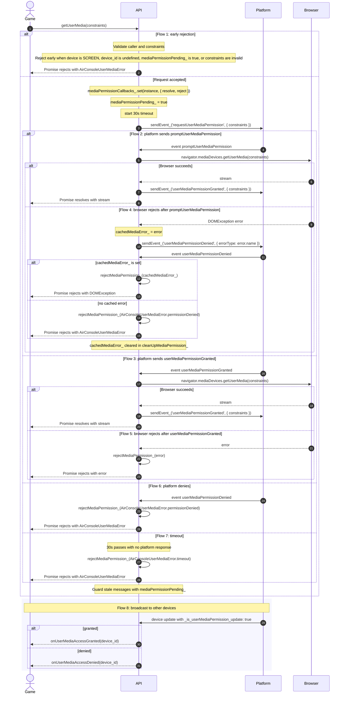

# Media Permission Flow

## Actors

**Game** calls `getUserMedia(constraints)` and consumes the returned Promise.

**API** is the AirConsole JS SDK running on the controller. It validates input, tracks pending state, talks to the platform, and bridges browser level failures back to the game.

**Platform** decides whether the permission flow should run through a browser prompt, resolve natively, deny with an error type, or return an error.

**Browser** is `navigator.mediaDevices.getUserMedia`, the final source of stream success or browser level failure.

## Sequence

## Key Design Decisions

The Promise resolves with the `MediaStream` on success and rejects with an `Error` on failure. Early rejections (SCREEN device, not ready, already pending, invalid constraints) return `Promise.reject(createAirConsoleUserMediaError(...))` directly. Platform denials, timeouts, and browser failures all go through `rejectMediaPermission_`, which calls the stored `reject` callback and always rejects with a typed `AirConsoleUserMediaError` — except when a cached `DOMException` is present, which is passed through directly to preserve `instanceof` checks.

Browser prompt failures use a cache-and-echo pattern. When the browser rejects with a `DOMException`, the API stores the error in `cachedMediaError_` and sends `sendEvent_('userMediaPermissionDenied', { errorType: error.name })` to the platform. When the platform echoes back `userMediaPermissionDenied`, the API checks `cachedMediaError_`: if set, it calls `rejectMediaPermission_(cachedMediaError_)` to preserve `instanceof DOMException` for the game; if not set, it rejects with a generic `AirConsoleUserMediaError.permissionDenied`. `cachedMediaError_` is cleared in `cleanUpMediaPermission_`.

Callback storage lives in a `WeakMap`, which keeps resolve and reject handlers attached to the SDK instance without exposing them on public state.

The 30 second timeout is a safety net. It rejects with `AirConsoleUserMediaError.timeout` if the platform never answers.

`mediaPermissionPending_` blocks duplicate requests and ignores stale platform messages after cleanup.
